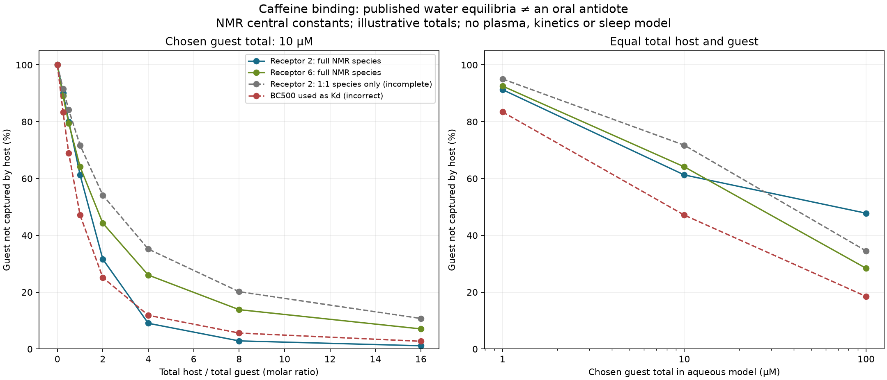

# Caffeine reversal: measured binding and missing oral pharmacology

This personal learning-project analysis was assembled and calculated by an AI
coding assistant on 2026-10-09. It does not represent laboratory work or source
review performed by the owner. It advances the earlier
[feasibility review](../oral-targeting-feasibility-2026-10-09/README.md)
by identifying measured caffeine binders and reconstructing an aqueous binding
model. No oral caffeine antidote, new validated molecule or sleep benefit is
established by this work.

## What the primary evidence supports

**Small-molecule recognition exists.** A sulfonated tweezer study measured
caffeine binding in water. Receptor 2 self-associates and forms both 1:1 and
2:1 host:caffeine complexes. Receptor 6 avoids detectable host aggregation,
but its NMR model also includes 1:2 host:guest binding. The paper's BC500
metric summarizes multiple equilibria; it is not generally a one-site Kd.
Paraxanthine was absent from the reported ligand panel.
[Primary study, Table 1](https://pubs.acs.org/doi/10.1021/acs.joc.1c02620).

| Host | NMR BC500, µM | ITC BC500, µM | Central 1:1 Kd calculated from NMR log β, µM |
|---|---:|---:|---:|
| Receptor 2 | 4.2 ± 1.1 | 5.8 ± 3.3 | 18.2 |
| Receptor 6 | 11.5 ± 0.8 | 15.0 ± 2.0 | 11.5 |

Reported uncertainties are retained without treating them as confidence
intervals. Constants came from D2O at pD 7.4 or H2O at pH 7.4, 298 K. The
reconstruction uses the NMR model and central estimates. These measurements
support recognition chemistry, not oral absorption, physiological competition,
plasma clearance or receptor displacement in vivo.

**DNA aptamers offer a second measured recognition route.** Four selected DNA
aptamers had ITC Kd values spanning 2.2–14.6 µM. A sensor detected caffeine in
20% human serum with a 4.0 µM detection limit. A detection limit is not Kd,
nor does diluted-serum sensing show that administering an aptamer can capture
a meaningful circulating amount. This assessment uses the official abstract
and author-repository metadata, not a newly inspected full manuscript.
[Primary paper](https://pubmed.ncbi.nlm.nih.gov/35143165/),
[author repository](https://uwspace.uwaterloo.ca/items/f648d4c1-43a3-4679-8b34-949a643dacdb).

**A 2026 RNA aptamer shows why the metabolite panel matters.** Caff-2.1 bound
caffeine with an ITC Kd of 4.8 µM, versus 18.8 µM for theobromine and 20.1 µM
for theophylline. Paraxanthine binding was not detected under the tested
conditions; that is not an infinite-Kd measurement. The study used biochemical
assays and caffeine-responsive RNA devices in yeast/mammalian cells. Gene
regulation is not stimulant neutralization or human treatment. Reporter
output also differed among ligands that bound, so a reporter alone would be
an unreliable capture assay.
[Primary study, Figure 2 and Results](https://academic.oup.com/nar/article/54/11/gkag584/8705637).

Another study found no intrinsic-fluorescence change for a caffeine DNA
aptamer. It investigated reporter behavior; failure of that signal does not
prove absence of binding.
[Primary fluorescence study](https://pubmed.ncbi.nlm.nih.gov/36431910/).

**Catalytic caffeine conversion exists in bacteria.** Purified caffeine
dehydrogenase converted caffeine to trimethyluric acid using an electron
acceptor; coenzyme Q0 was preferred. A separate study characterized an
NADH-dependent downstream monooxygenase and further products. Neither
abstract establishes safe, pharmacologically inactive products in humans or
an orally absorbed, circulating enzyme system. This review accessed these
official primary abstracts; fullTextXML retrieval failed.
[Dehydrogenase study](https://pubmed.ncbi.nlm.nih.gov/17981969/),
[downstream-pathway study](https://pubmed.ncbi.nlm.nih.gov/22609920/).

An enzyme-based diagnostic detected caffeine in beverages and human milk.
That is ex vivo assay performance, not activity after oral enzyme
administration. It supports measurement, not reversal after distribution
into the body.
[Diagnostic study](https://pubmed.ncbi.nlm.nih.gov/25019418/).

## The calculation added here

[binding_constants.json](binding_constants.json) records source locations,
units, reported uncertainties and each modeled species. In particular,
cumulative β for R2G has units M^-2 and cannot be inserted into a 1:1 Kd
formula. The solver uses:

```text
[R_n G_m] = β_nm [R]^n [G]^m
R_total = [R] + Σ n [R_n G_m]
G_total = [G] + Σ m [R_n G_m]
```

The sums include host dimers/tetramers and guest dimers where reported.
Guest dimers are not labeled inactive or host-captured. The plotted endpoint
counts all guest units that are not in a host-containing complex.

[binding_model.py](binding_model.py) produces
[96 illustrative equilibria](illustrative_equilibria.csv). Totals of 1, 10
and 100 µM and host:guest ratios of 0–16 were chosen for chemistry
illustration; they are not measured blood concentrations, intake levels,
human thresholds or a regimen. Two misleading shortcuts are deliberately
included and labeled: retaining only the 1:1 species, and inserting BC500 as
a one-site Kd.

At the chosen 10 µM guest total and equal host/guest totals:

| Model | Guest not captured by host |
|---|---:|
| Published receptor-2 NMR species | 61.3% |
| Published receptor-6 NMR species | 64.1% |
| Receptor-2 1:1 species only, incomplete | 71.7% |
| BC500 treated as Kd, incorrect | 47.1% |

These are new calculations, not observed capture percentages. The incorrect
shortcut can misstate capture in either direction as totals change. Even the
complete reconstruction assumes ideal source-medium equilibria. It excludes
proteins, other guests, electrolyte effects, uncertainty propagation,
transport, binding kinetics and clearance. It does not rank oral medicines.



## A concrete oral-development hypothesis

The tweezer family is a measured recognition starting point. My inference is
that physiological recognition and retained oral exposure are the decisive
next questions. Sulfonate-mediated water compatibility does not itself show
gut permeability. A transportable precursor that releases an active host
systemically is an **unvalidated prohost concept**. Both species need measured
distribution and clearance; activation must preserve recognition. No specific
masking chemistry, improved oral performance or safe precursor is asserted.

| Requirement | Decisive evidence | Meaning if absent |
|---|---|---|
| Physiological recognition | Orthogonal free-caffeine measurements in an appropriate matrix, distinguishing host capture, protein binding and assay interference | Water affinity remains a chemistry lead |
| Metabolite coverage | Separate caffeine/paraxanthine/theophylline/theobromine binding and functional readouts, followed by mixtures | Parent capture cannot establish removal of stimulant activity |
| Endogenous selectivity | Adenosine and relevant endogenous ligands/signaling assessed alongside capture | Target selectivity is incomplete |
| Systemic oral exposure | Intact active-host and precursor PK, distinguishing blood exposure from gut retention | No post-absorption reversal claim |
| Sustained removal | Free/total guest, host-bound guest, intact host and products followed through release/clearance | Sequestration may be temporary with rebound |
| Brain response | Time-dependent target engagement and redistribution assessed independently of plasma totals | Plasma capture cannot establish rapid central reversal |
| Human sleep outcome | Controlled clinical endpoints including residual metabolite/circadian effects | No claim that late caffeine becomes compatible with normal sleep |

These are research requirements, not results or personal-administration
instructions. Affinity alone supplies none of the distribution, residence-time
or elimination terms.

Paraxanthine is a human caffeine metabolite, and a primary rat study found
psychostimulant activity with mechanisms extending beyond a simple copy of
caffeine's effects. This supports metabolite coverage as a separate requirement;
it does not quantify residual human sleep impairment.
[Primary pharmacology study](https://pubmed.ncbi.nlm.nih.gov/23261866/).

The proposed mechanism removes accessible free ligand, allowing ordinary
receptor dissociation and redistribution. It does not directly eject bound
caffeine. A second antagonist occupying adenosine receptors would not restore
adenosine signaling merely by competing with caffeine. Agonist compensation
would be a different intervention, without removing caffeine. A gut-retained
binder also does not show rapid removal of caffeine already distributed into
blood and brain. These are mechanistic inferences, not efficacy findings.

## Other stimulants and peptide ligands

The [earlier primary-source review](../oral-targeting-feasibility-2026-10-09/README.md)
documents molecular-container reversal precedents for selected stimulants
and designed protein binders for selected peptide hormones. Those support
ligand-specific research, not a universal stimulant off-switch. Charge,
accessible shape, concentration, metabolites, binding rate and tissue access
all matter; molecular size alone cannot rank reversal ease.

For a peptide ligand, a larger recognition surface may offer specificity and
a smaller circulating amount may lower stoichiometric capacity requirements.
These are conditional advantages, not evidence of easier oral delivery or
faster receptor dissociation. A peripheral binder can miss a central ligand,
and extracellular removal need not promptly undo downstream signaling.
Receptor antagonism, ligand capture and catalytic degradation need distinct
endpoints rather than a shared "knock off" score.

## Provenance and reproduction

[source_receipts.json](source_receipts.json) includes seven primary-source
records, access limitations and hashes for three official full-text XML
downloads. Copyrighted full text stays in ignored storage. No vendor claims
are used. No curated evidence grade or frozen benchmark input changes.

Run inside the workspace Docker `dev` service:

```bash
cd geroscience-compound-atlas/studies/caffeine-reversal-2026-10-09
../../.venv/atlas-review-runtime/bin/python binding_model.py
../../.venv/atlas-review-runtime/bin/python -m unittest test_binding_model -v
../../.venv/atlas-review-runtime/bin/python plot_equilibria.py
cd ../..
.venv/atlas-review-runtime/bin/pytest tests/test_hypothesis_filters.py tests/test_splits.py -q
.venv/atlas-review-runtime/bin/ruff check studies/caffeine-reversal-2026-10-09 --ignore EXE002
```

The solver uses the standard library; plotting requires matplotlib. Nine
mathematical checks cover analytic 1:1/dimer references, recovery of an
independently constructed multimer state, two-guest accounting, mass balance,
nonnegativity, monotonicity and input rejection. They validate calculation
behavior, not oral delivery, sleep reversal or biological age.
