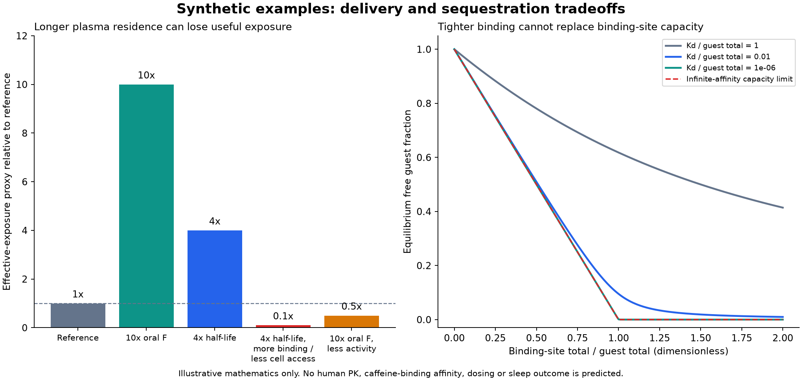

# Oral delivery, organ targeting and stimulant reversal: feasibility analysis

Prepared 2026-10-09 by an AI coding assistant for this personal hobby and
learning project. Primary studies, regulatory documents and registry records
support the observations below. Proposed modifications are research hypotheses.
No new molecule has been synthesized, tested or shown to improve human oral
exposure, sleep, fertility or biological age. This is a focused feasibility
review, not a systematic review or a prescribing document.

The [continuation and prioritized research decisions](RESEARCH_DECISIONS.md)
add full-text SLU metabolism findings, FDA human PK context, a negative oral
SBT-272 development disclosure, parent manufacturing precedents, SS-31 clock
versus function evidence, and a competitive binding calculation. That review
supersedes the initial abstract-only metabolism limitation below. The
[SS-31 analog audit](../ss31-analog-audit-2026-10-09/README.md) subsequently
identifies the Tyr comparator as published SPN4 and adds exact molecular graphs.

## Biological age is a collection of measurements

Human plasma-proteomic research estimated distinct aging signatures for eleven
organs; organ age gaps were associated with different diseases. This supports
organ-specific assessment, but does not establish those clocks as causal
surrogates for reversing aging. [Organ-aging study](https://www.nature.com/articles/s41586-023-06802-1).

In the randomized CALERIE study, caloric restriction affected DunedinPACE but
not PhenoAge or GrimAge. A change in one measurement therefore cannot stand in
for a change in every aging process. [CALERIE methylation analysis](https://www.nature.com/articles/s43587-022-00357-y).

For a compound comparison, prespecify the organ, disease or deficit; a functional
endpoint; an independent molecular endpoint; adverse effects; and whether an
effect persists after exposure ends. Keep clock shifts, telomere changes,
improved function and survival as different outcomes. This evaluation framework
is an inference from the limitations of those studies, not a validated new
aging score.

Human rapamycin research now exists, but is mixed. PEARL found no significant
change in its primary visceral-adiposity outcome, alongside some secondary
and subgroup benefits. RAPA-EX-01 found no significant improvement in its primary
intention-to-treat functional outcome; sensitivity analyses favored placebo.
Neither establishes whole-body rejuvenation or reproductive safety for a new
rapalog. [PEARL](https://pubmed.ncbi.nlm.nih.gov/40188830/),
[RAPA-EX-01](https://pubmed.ncbi.nlm.nih.gov/41985884/).

## Four different kinds of selectivity

Target selectivity, tissue distribution, cell-type selectivity and organelle
targeting are separate design variables. Systemic circulation can expose many
organs even when the useful endpoint was measured in one organ.

| Compound | Supported mechanistic context | What cannot be inferred |
|---|---|---|
| SLU-PP-915 | Pan-ERR agonism; mouse skeletal-muscle/exercise effects and cardiac-disease-model research | Muscle-exclusive distribution, human exercise replacement or age reversal |
| SS-31 / elamipretide | Cardiolipin-associated mitochondrial targeting | Heart-exclusive targeting or equivalent efficacy in all mitochondria-containing tissues |
| MOTS-c | Mitochondrial-encoded signaling peptide; muscle/metabolic effects in mice | That the peptide itself selectively accumulates inside mitochondria or that administered human treatment reproduces endogenous exercise responses |
| Epitalon | Reported telomere-related cell-culture effects | Organ-specific or systemic rejuvenation in humans |
| Rapamycin | Broad mTOR pathway modulation | Selective protection of a desired organ while sparing testicular signaling |

The ERR chemical series showed activity across ERR isoforms; a separate study
examined cardiac outcomes in mice. [ERR discovery](https://pubmed.ncbi.nlm.nih.gov/37421886/),
[cardiac research](https://pubmed.ncbi.nlm.nih.gov/37961903/).
MOTS-c improved physical-capacity endpoints in mice, while the human part
measured endogenous peptide responses to exercise. Those are different
experiments. [MOTS-c primary study](https://www.nature.com/articles/s41467-020-20790-0).

## SLU-PP-915: improve the existing oral lead, rather than assume it needs rescue

SLU-PP-915 already showed oral exposure and exercise-related activity in mice.
The study reported a short oral plasma half-life, approximately 18–28 minutes;
that number is not a human half-life. Oral activity does not supply an absolute
human bioavailability estimate. [Oral mouse study](https://pubmed.ncbi.nlm.nih.gov/41421047/).

The original medicinal-chemistry series used a boronic-acid replacement that
retained ERR activity and improved microsomal stability. A 2026 study identified
seven phase-I products for SLU-PP-915 in human liver preparations. Neither
observation tells us which process dominates human oral exposure.
[Chemical series](https://pubmed.ncbi.nlm.nih.gov/37421886/),
[metabolism study](https://pubmed.ncbi.nlm.nih.gov/41588687/).

My first design hypothesis is a formulation comparison using the unchanged
parent. Compare dissolution-limited exposure against presystemic metabolism
before changing the pharmacophore. Include enzyme-free chemical-stability
controls: the [subsequently retrieved full paper](RESEARCH_DECISIONS.md)
reports several products in enzyme blanks. Dispersion, particle-size and solid-state
approaches are candidate formulation classes, not established improvements
for this compound. A structural optimization program should then use confirmed
metabolite structures and binding data to choose substitutions. The initial
abstract alone did not identify sufficient site-level detail. The continuation
now maps reported transformations and the control finding; it still does not
establish a dominant human clearance pathway or justify calling a particular
substitution an improved oral analog.

The relevant relation is F = Fa × Fg × Fh: intestinal absorption, escape from
intestinal metabolism and escape from hepatic first-pass metabolism all matter.
An oral-versus-intravenous exposure comparison distinguishes bioavailability
from elimination; oral versus intraperitoneal activity alone does not do that.
Higher reporter potency, a Lipinski calculation or a favorable docking pose
cannot establish oral improvement. A longer effect also need not track the
short plasma half-life when transcriptional responses persist.

**Decision gate:** preserved ERR activity and selectivity, improved reproducible
oral exposure, characterized metabolites, and the intended functional response
at matched unbound exposure. No improved SLU-PP-915 analog is claimed here.

## Oral peptides: stability, intestinal entry and useful tissue exposure

Terminal capping may reduce some proteolysis. It does not solve all backbone
cleavage, membrane permeability or first-pass barriers. Oral semaglutide
provides a formulation-specific gastric absorption precedent; its mechanism
cannot simply be assigned to another peptide. A separate cyclic-peptide study
obtained oral availability in rats by jointly optimizing activity and
permeability. [Semaglutide absorption experiment](https://pubmed.ncbi.nlm.nih.gov/30429357/),
[cyclic-peptide research](https://www.nature.com/articles/s41589-023-01496-y).

The transferable principle is to optimize retained biological activity together
with stability and permeability. Cyclization, N-methylation and selected
D-amino-acid substitutions are candidate levers. Their applicability depends
on the peptide's active conformation and mechanism; improvements elsewhere
are precedents, not evidence that a modified SS-31 or MOTS-c will work orally.

| Peptide | First useful research direction | Main failure criterion |
|---|---|---|
| SS-31 | Establish reproducible parent oral exposure; assess formulations while preserving mitochondrial activity | Higher plasma levels with lost mitochondrial access or activity |
| MOTS-c | Establish the active molecular species and functional assay before extensive structural changes | Stable analog loses the parent signaling response or intracellular trafficking |
| N-acetyl Epitalon | Verify exact identity and a reproducible biological effect before an oral optimization campaign | Capping changes chemistry without credible efficacy or measured exposure |

Two human oral Bendavia/SS-31 phase-I studies are recorded as completed, with
no posted results in the retrieved registry records. They establish that oral
development was attempted, not its success. [Single-administration registry](https://clinicaltrials.gov/study/NCT01754818),
[repeat-administration registry](https://clinicaltrials.gov/study/NCT01786915).
CB4211 has a completed human phase-I registry record, also without posted
results in that record; it is not a validation of oral native MOTS-c.
[CB4211 registry](https://clinicaltrials.gov/study/NCT03998514).

One recent oral colon-targeted nanoparticle paper attached SS-31 to a carrier
containing kaempferol. Its mouse colitis result is local composite-platform
evidence, not proof of systemic oral free SS-31 exposure.
[Carrier study](https://pubmed.ncbi.nlm.nih.gov/42638278/).

## SS-31 duration and manufacturing hypotheses

SS-31 already includes D-Arg and C-terminal amidation. The FDA document describes
sequential C-terminal degradation and urinary elimination of parent and
metabolites. Therefore an N-terminal acetyl group does not directly address
the documented C-terminal pathway or intact-parent renal clearance.
[Elamipretide label, sections 11–12.3](https://www.accessdata.fda.gov/drugsatfda_docs/label/2025/215244s000lbl.pdf).

The peptide's aromatic/cationic organization matters for its mitochondrial
interactions; the related SS-20 scaffold lacks the phenolic group associated
with radical scavenging. Simpler ingredients cannot be treated as functionally
interchangeable. [SS-family primary experiment](https://pubmed.ncbi.nlm.nih.gov/15178689/),
[SS-31 cardiolipin experiment](https://pmc.ncbi.nlm.nih.gov/articles/PMC3736700/).

The chemistry bookkeeping below uses neutral covalent peptides, excluding salts.
Charges are nominal estimates near physiological pH, not measured pKa values.
Hypothesis rows remain unvalidated here; SPN4 is a published comparator with
endpoint-specific membrane/cell evidence. No novelty claim is made.

| Specification | Nominal charge | Research rationale and uncertainty |
|---|---:|---|
| D-Arg-Dmt-Lys-Phe-NH2 (SS-31 reference) | +3 | Reference structure for retained activity comparisons |
| Ac-D-Arg-Dmt-Lys-Phe-NH2 | +2 | N-terminal protection hypothesis; removes one positive charge and may impair targeting |
| D-Arg-Dmt-Lys-D-Phe-NH2 | +3 | C-terminal stereochemical protection hypothesis; activity and degradation response unknown |
| D-Arg-Tyr-Lys-Phe-NH2 (SPN4) | +3 | Published simpler-residue comparator; activity differs by endpoint, cost/oral equivalence unknown |
| Phe-D-Arg-Phe-Lys-NH2 (SS-20 reference) | +3 | Published comparator; not an established cheaper SS-31 equivalent |

The D-Phe comparator preserves formula, nominal charge and mass while changing
one stereocenter. That makes it a useful discriminating hypothesis for
C-terminal degradation, but provides no evidence of better half-life or oral
absorption. Renal clearance could still dominate. The Tyr comparator is
published as SPN4; see the linked analog audit for measured endpoint tradeoffs.
It reduces specialty-residue requirements in principle; actual manufacturing
cost requires yield, purification, stability and quality-control data.

A second duration hypothesis is a reversible albumin-binding conjugate that
releases active parent. Fatty-acid conjugation and albumin-affinity optimization
have a genuine precedent in semaglutide development. But SS-31 must reach
intracellular mitochondria, so prolonged albumin-bound circulation could reduce
useful access. A release mechanism, rather than permanent attachment alone,
would need evaluation. [Semaglutide medicinal chemistry](https://pubmed.ncbi.nlm.nih.gov/26308095/).

For cost, distinguish chemical manufacturing, sterile formulation, quality
control and marketed price. More elaborate conjugation or low oral F could
increase material and development requirements. Longer residence time is not
automatically cheaper treatment. No price or manufacturing saving was measured.

## N-acetyl Epitalon and Adamax are weak validation precedents

The archived Europe PMC title/abstract search returned zero hits for the
specified N-acetyl Epitalon variants. The scoped Adamax search returned one
machine-learning paper using the AdaMax optimizer, not a Semax analog study.
These bounded searches did not locate comparative peptide PK evidence; they
do not prove that no unindexed or differently named experiment exists.
[Exact search receipt](public_search_receipt.json),
[irrelevant AdaMax hit](https://pubmed.ncbi.nlm.nih.gov/41241764/).

N-acetylation and an acetate salt are chemically different. A covalent
N-acetyl cap removes the positive terminal amine. In Epitalon, acidic Glu, Asp
and the free C-terminus remain: the nominal charge changes from −2 to −3.
Adding C-terminal amidation gives a distinct molecule, nominally −2. This
bookkeeping does not demonstrate passive absorption; the acetylated free acid
is not automatically less ionic or orally available.

Cell-culture studies report telomere effects for the parent. A newer study also
examined cancer lines and alternative lengthening of telomeres. Neither shows
human systemic rejuvenation or validates acetylated variants. Telomere extension
alone is therefore an inadequate efficacy or safety gate.
[Original cell study](https://pubmed.ncbi.nlm.nih.gov/12937682/),
[2025 cell-line study](https://pubmed.ncbi.nlm.nih.gov/40908429/).

## Caffeine reversal: remove free ligand or restore signaling

Caffeine antagonizes adenosine receptors; mouse receptor-knockout work
implicated A2A in its wake-promoting effect. A competing receptor antagonist
would not restore normal adenosine signaling merely by displacing caffeine.
A receptor agonist could alter signaling but would not eliminate circulating
caffeine, and its physiological effects would require separate evaluation.
[Receptor experiment](https://www.nature.com/articles/nn1491).

An actual sequestrant would bind free caffeine as receptor-bound molecules
dissociate and redistribute. The design problem is affinity, binding capacity,
selectivity, physiological competition and removal of the bound complex.
Lowering free blood concentration might draw drug out of the brain; the speed
depends on equilibration and cannot be predicted by a simple equilibrium model.
A gut-confined binder would principally intercept material in the gut, rather
than promptly remove caffeine already distributed through the body.

Drug capture has a clinical precedent in intravenous sugammadex for specific
neuromuscular blockers. It is not an oral caffeine antidote. Supramolecular
hosts have also reduced methamphetamine-related locomotor effects in mice;
those results do not establish caffeine binding, oral availability or human
sleep restoration. [Sugammadex label](https://www.accessdata.fda.gov/drugsatfda_docs/label/2024/022225s014lbl.pdf),
[TetM0 experiment](https://pubmed.ncbi.nlm.nih.gov/34613641/).

Caffeine's active metabolites complicate a clearance strategy. Faster parent
disappearance is insufficient if pharmacologically active methylxanthines
remain. A broadly induced metabolic enzyme is also a poor assumption for an
immediate, selective switch-off. [Human-enzyme biotransformation experiment](https://pubmed.ncbi.nlm.nih.gov/8857078/),
[paraxanthine pharmacology experiment](https://pubmed.ncbi.nlm.nih.gov/23261866/),
[human paraxanthine metabolism study](https://pubmed.ncbi.nlm.nih.gov/2913277/).

Human experiments found sleep disruption after caffeine consumed before sleep
and a separate study found a circadian phase effect. Receptor occupancy,
subjective drowsiness, normalized sleep architecture and circadian timing are
different reversal endpoints. [Sleep experiment](https://pubmed.ncbi.nlm.nih.gov/24235903/),
[circadian experiment](https://pubmed.ncbi.nlm.nih.gov/26378246/).

**Feasibility judgment:** a selectively absorbed caffeine/metabolite-binding
molecule is a legitimate discovery goal. The reviewed sources do not provide
a validated oral human caffeine-reversal candidate. Screening known host
families for real physiological binding is more informative than inventing a
high-affinity structure from docking alone.

## Are other stimulants or stimulant peptides easier to reverse?

Some positively charged, hydrophobic small molecules fit established
supramolecular host chemistry better than neutral caffeine. This is a
structure-dependent inference, supported by the host-family binding results;
it is not a universal ranking of stimulants. Transporter substrates and drugs
with downstream intracellular effects can remain pharmacodynamically complex
even after extracellular parent concentrations fall.

Peptides can offer larger recognition surfaces. Researchers have designed
high-affinity binders for several helical peptide hormones. That does not
establish neutralization of Semax, MOTS-c or every stimulant peptide, and a
large protein binder introduces its own delivery and distribution problem.
[Designed peptide-binding proteins](https://www.nature.com/articles/s41586-023-06953-1).

For any specific peptide, first identify the active species, accessible
compartment, whether fragments remain active, and how long downstream signaling
persists. Binding a circulating peptide is different from rapidly reversing a
neural response already initiated. There is no demonstrated oral universal
peptide-stimulant off-switch in the sources reviewed.

## A reproductive-sparing rapamycin program

There is a human reproductive signal beyond the animal shrinkage question:
transplant studies associated sirolimus with impaired sperm-related outcomes,
and a small clinical series reported recovery after discontinuation. These
populations do not provide a risk estimate for otherwise healthy humans or a
new analog; semen effects and testicular volume are different endpoints.
[Transplant cohort](https://pubmed.ncbi.nlm.nih.gov/18510638/),
[clinical series](https://pubmed.ncbi.nlm.nih.gov/19774480/).

Mouse developmental work found mTORC1 is required for spermatogonial
differentiation. Consequently, an mTORC1-selective compound cannot be declared
fertility-sparing merely because it spares mTORC2. The developmental model is
not itself an adult-human risk estimate.
[Spermatogonial study](https://pmc.ncbi.nlm.nih.gov/articles/PMC4641790/).

The strongest design objective is selective *functional exposure*: preserve a
chosen benefit in the target tissue while reducing testicular pathway
inhibition. Tissue-activated prodrugs, local delivery or restricted distribution
are candidate approaches. Shorter systemic residence and mTOR-substrate bias
are additional hypotheses, not established solutions. Measuring total tissue
concentration alone would be inadequate; free exposure and pathway responses
must be compared.

RapaLink-1 plus RapaBlock supplies a real brain-restricted binary-pharmacology
precedent in mouse cancer models. It does not demonstrate selective testicular
protection or organism-wide geroprotection. Brain restriction is useful only
when the desired benefit is in the brain, and cannot be relabeled as systemic
anti-aging. [Binary-pharmacology study](https://www.nature.com/articles/s41586-022-05213-y).

An assessment should separately track desired-tissue function, testicular
mTORC1 and mTORC2 responses, sperm quantity/quality, endocrine effects,
testicular structure and reversibility. A blood–tissue barrier assumption or
unrelated acute toxicity screen cannot replace those endpoints. No particular
new rapalog is established as reproductively safer in this analysis.

## Calculated results and their boundaries

[Peptide specifications](peptide_hypotheses.json) record eight reference or
hypothesis structures, neutral formulae, average masses and nominal charges.
They carry no predicted affinity, oral F or human half-life.

The linear, equal-volume exposure proxy is proportional to F × relative
half-life × relative free fraction × cellular access × retained activity.
All parameter values are synthetic. A fourfold longer half-life combined with
a free-fraction factor of 0.05 and a cell-access factor of 0.5 gives only
0.1 times the reference proxy despite longer circulation. This is a mathematical
counterexample, not a forecast for lipidated SS-31. Nonlinear kinetics,
receptor saturation and pharmacodynamic persistence are omitted.

For one-to-one binding at equilibrium, arbitrarily high affinity cannot bind
more guest molecules than available binding sites. With binding-site total
equal to half the normalized guest total, at least half the guest remains free.
The grid has no measured caffeine affinity, kinetics, metabolites, competitors
or brain compartment and predicts no sleep outcome.



Reproduce in the workspace Docker `dev` service:

```bash
cd geroscience-compound-atlas/studies/oral-targeting-feasibility-2026-10-09
python3 analysis_models.py
python3 -m unittest test_analysis_models -v
../../.venv/atlas-review-runtime/bin/python plot_sensitivity.py
```

The model uses the standard library. Plotting requires matplotlib; the final
command names the local development environment used for this run. The seven
checks cover physical capacity, mass conservation, monotonicity, limiting
cases, invalid inputs and an independent FDA molecular-mass reference.

## Next executable research decisions

1. Retrieve and review full SLU-PP-915 metabolism/SAR data and the unpublished
   oral Bendavia results if accessible. Identify what actually limits exposure.
2. Compare SS-31 parent, terminal D-Phe and Tyr comparators in retained-function
   and degradation assessments before calling either an improvement.
3. Choose a target organ and an efficacy endpoint for rapamycin distribution
   work; evaluate reproductive outcomes as independent gates.
4. For caffeine capture, qualify binding to caffeine and active metabolites
   under physiological competition before proposing an orally absorbed host.
5. Establish exact molecular identity and reproducible efficacy before treating
   acetylated Epitalon or Adamax as delivery-optimization starting points.

These are proposed decision gates. No paper review, wet-lab measurement,
candidate selection or biological validation is attributed to the owner.
