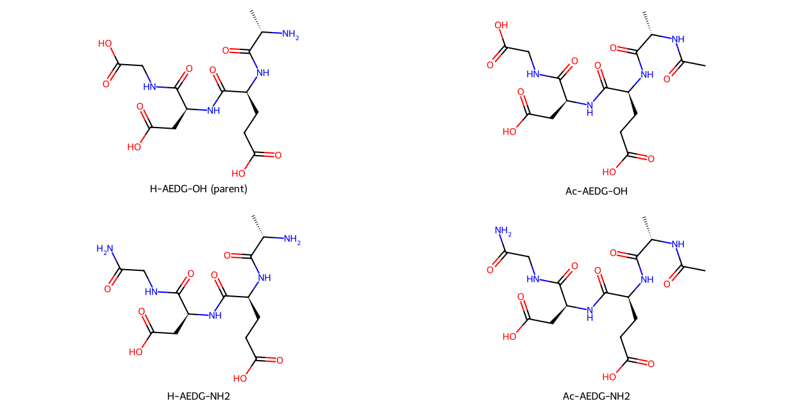

# MOTS-c and Epitalon: what terminal modifications can establish

Prepared 2026-10-09 by an AI coding assistant for this personal hobby and
learning project. This continuation adds primary-source review and nine
exact peptide graphs. No peptide was synthesized or tested. No owner
laboratory work or source review is claimed. The panel defines comparisons,
not validated oral medicines or biological-age interventions.

## MOTS-c: longer residence can coexist with weaker function

A primary K14Q study reported diminished insulin-sensitizing effects despite
2.6-fold slower calculated clearance. Its clearance comparison used mouse
pump infusion and steady-state ELISA, with variant-specific calibration.
That is not a human terminal-half-life measurement, and immunoreactivity
does not independently quantify intact peptide. The result nevertheless
provides a concrete counterexample to treating persistence as efficacy.
[Primary K14Q study, Results and Methods](https://pubmed.ncbi.nlm.nih.gov/33468709/).

A 2024 study reported MOTS-c binding to CK2α by surface plasmon resonance:
Kd 1 nM for native peptide and 16.2 nM for K14Q. MOTS-c was immobilized and
CK2α flowed over the sensor. Native peptide increased CK2 activity in a
cell-free assay; K14Q did not. In the tested mouse context, CK2-substrate
phosphorylation increased in skeletal muscle, decreased in epididymal fat,
and showed no detected change in liver. This establishes useful mechanistic
comparators, not selective delivery, universal tissue responses or human
target occupancy. AlphaFold interaction contacts in the paper are predictions,
not a resolved complex.
[Primary CK2 study, Figures 2–3 and 5](https://pubmed.ncbi.nlm.nih.gov/39559755/).

An earlier nuclear-trafficking study separates another pair of functions.
Replacing YIFY residues 8–11 with alanines prevented nuclear entry of the
EGFP fusion; replacing basic RKLR residues 13–16 did not prevent entry.
Both mutations lost binding to tested DNA sequences. Localization and DNA
binding therefore cannot be treated as the same endpoint. EGFP/FITC labels
and overexpression also differ from native-peptide pharmacokinetics.
[Primary nuclear study, Figures 1 and 4](https://pubmed.ncbi.nlm.nih.gov/29983246/).

The design inference is to preserve parent target engagement, relevant
cellular activity and trafficking as separate requirements. There is now
specific CK2 evidence to examine; it does not explain every MOTS-c effect
or justify transferring one tissue's response to another.

## Exact terminal-comparison matrices

[JSON specifications](structural_comparators.json) and
[SDF graphs](structural_comparators.sdf) define all-L peptides with explicit
termini. N-acetylation is a covalent change; an acetate counterion is not.
The matrix separates N-terminal acetylation from C-terminal amidation before
combining them. Amidation applies only to the terminal carboxyl group,
preserving Asp/Glu side-chain acids and Lys side-chain amine.

| Defined form | MOTS-c sequence form / nominal charge | Epitalon sequence form / nominal charge |
|---|---|---|
| Parent, both ends free | H-MRWQEMGYIFYPRKLR-OH / +3 | H-AEDG-OH / −2 |
| N-acetyl only | Ac-MRWQEMGYIFYPRKLR-OH / +2 | Ac-AEDG-OH / −3 |
| C-terminal amide only | H-MRWQEMGYIFYPRKLR-NH2 / +4 | H-AEDG-NH2 / −1 |
| Both caps | Ac-MRWQEMGYIFYPRKLR-NH2 / +3 | Ac-AEDG-NH2 / −2 |

Charge uses ordinary Arg/Lys/Glu/Asp and terminal states near physiological
pH. It is not a measured ionization curve. The drawn neutral graphs carry
formal charge zero; the nominal biological charge is a separate convention.
Equal nominal net charge does not mean equal charge distribution, binding
or permeability. None of the capped forms has improved oral performance
established by this review.

The ninth graph is H-MRWQEMGYIFYPRQLR-OH, the K14Q sequence comparator
(nominal +2). Its free-acid form is defined explicitly here; the original
study preparation's terminal identity was not independently verified. It
is a functional counterexample, not an improved candidate.



### Identity checks and mass conventions

Native MOTS-c, Epitalon and N-acetyl Epitalon match independently retrieved
official formulas, stereochemical InChIKeys and monoisotopic masses.
[MOTS-c reference](https://pubchem.ncbi.nlm.nih.gov/compound/146675088),
[Epitalon reference](https://pubchem.ncbi.nlm.nih.gov/compound/219042),
[acetylated free-acid reference](https://pubchem.ncbi.nlm.nih.gov/compound/171390141).
A registry structure does not establish activity or certify a physical sample.

MOTS-c's retrieved PubChem fields distinguish ExactMass 2174.1110958 Da
from MonoisotopicMass 2173.1077409 Da. Their difference is approximately
one carbon-isotope increment. The graph check uses the explicitly named
monoisotopic field, matching RDKit's calculation; it does not loosen the
identity tolerance to accept a one-dalton discrepancy. Both fields remain
in [identity_references.json](identity_references.json). This observation
about the retrieved fields is not a measured sample isotope distribution.

N-acetyl Epitalon free acid is C16H24N4O10; the acetylated amidate is
C16H25N5O9. Their calculated average masses are 432.386 and 431.402 Da,
respectively. They are distinct compounds. The cap does not remove the
acidic side chains. In the neutral-graph calculation, Epitalon's default
RDKit TPSA changes from 225.22 to 228.30 Ų with N-acetylation; native
MOTS-c changes from 839.39 to 842.47 Ų. A cap does not automatically
reduce this descriptor. TPSA is not exposed polarity in a conformational
ensemble and does not predict oral availability here.

## What the Semax and adamantane precedents actually show

**Acetylation can change a useful function.** A direct Semax/Ac-Semax
study found altered copper coordination and loss of the parent's protection
against copper-induced toxicity in SH-SY5Y cells. Zinc complexation was
comparable. This is endpoint-specific evidence, not proof of lost cognition
or generalized toxicity. It supplies neither oral PK nor an Adamax result.
[Primary acetylation study, official abstract](https://pubmed.ncbi.nlm.nih.gov/27586814/).

An indexed 2013 report is titled *Stability of Semax acetyl to proteolysis
in various biological media*. Retrieved metadata contains no abstract.
Its existence is verified; no numerical stability gain or C-terminal
identity is inferred from the title. This distinction prevents both claiming
that no acetylation research exists and inventing the unavailable result.
[Primary metadata](https://pubmed.ncbi.nlm.nih.gov/23652441/).

**A defined adamantane-containing peptide has oral animal evidence.** The
P021 study reported outcomes after oral dietary treatment in female
3xTg-AD mice, including cognitive and tau-related endpoints. This review
uses that study's official abstract. A later full-text study also reports
chronic oral prevention results and explicitly calls for further PK/PD work.
Its gastric, intestinal-fluid and plasma-stability claims cite earlier work;
they are not new stability measurements in that study. The construct combines
a CNTF-derived sequence with terminal chemistry and an adamantane-containing
unit. Those reports do not isolate an acetylation/adamantane contribution,
supply human oral availability, or validate an analogous attachment to
Semax, SS-31, Epitalon or MOTS-c.
[Primary oral study](https://pubmed.ncbi.nlm.nih.gov/25046994/),
[primary prevention study](https://pubmed.ncbi.nlm.nih.gov/28655344/).

The fresh scoped title/abstract search for Adamax with peptide/Semax terms
returned zero hits. The acetyl-Epitalon spelling search also returned zero.
Exact queries and dates are in [source receipts](source_receipts.json).
These bounded results do not prove absence of differently named or unindexed
experiments. No specific Adamax graph, superior half-life or BBB benefit is
assigned from the name alone. A physical Adamax comparison needs unambiguous
linkage, stereochemistry, terminal identity and supporting measurements.

## Current human-trial records remain distinct

The official NCT07505745 record reports **Recruiting**, was last updated
April 1, 2026, and lists subcutaneous MOTS-c administration with no posted
results at retrieval. That is a registered human-intervention plan, not an
oral study or independently verified recruitment/efficacy result. The record
does not certify the exact administered molecular material.
[Native-name trial record](https://clinicaltrials.gov/study/NCT07505745).

NCT03998514 reports **Completed**, subcutaneous CB4211, last updated May 11,
2021, without posted results. That analog record cannot validate native
MOTS-c or an oral formulation. Absence of posted registry results also does
not prove that no sponsor or conference report exists.
[CB4211 record](https://clinicaltrials.gov/study/NCT03998514).

## Which comparison would advance oral development

| Program | Concrete comparison | Required evidence to advance |
|---|---|---|
| MOTS-c oral parent | Protect/deliver unchanged parent versus a defined parent reference | Intact-parent recovery and systemic exposure, CK2 engagement plus relevant cellular/organ function |
| MOTS-c terminal modifications | Each single cap versus parent, followed by the combined cap | Separate proteolytic cleavage, intact exposure, target binding/activity and trafficking; retain K14Q as a functional caution |
| Epitalon terminal modifications | Four-form matrix with verified identity | Reproducible relevant parent-versus-cap function and intact-species exposure before attributing any effect to improved delivery |
| Adamantane transfer | One fully specified linkage versus its parent scaffold | Direct activity and exposure comparison; distinguish whole conjugate, released parent and products |

This order is a research judgment. It does not select an oral medicine.
Single caps isolate variables; they are not assumed functionally tolerated.
Improved protease resistance alone cannot establish membrane transport,
first-pass survival, useful tissue exposure or sustained function. Protein
attachment/lipid conjugation likewise requires accessible active species;
longer total circulation can coexist with reduced target access.

For Epitalon, telomere length is insufficient as the benefit criterion.
A 2025 primary study examined telomerase/alternative telomere-lengthening
responses in several cell lines, including cancer lines. It did not compare
the capped forms or establish human rejuvenation. Its cancer-cell findings
also do not measure human cancer incidence. Keep telomere regulation,
functional benefit and safety endpoints separate.
[Primary cell-line study](https://pubmed.ncbi.nlm.nih.gov/40908429/).

## Provenance and reproduction

Receipts cover eight primary papers, two registry records and three official
property retrievals, plus scoped searches. Five full texts were retrieved
through official Europe PMC/NCBI BioC APIs. Abstract-only and metadata-only
access is identified individually. Copyrighted full text and complete
registry downloads remain in ignored local storage. Quantities or treatment
regimens are not copied into this review.

[observations.json](observations.json) preserves assay context separately
from the structural hypotheses. No surrogate score, oral rank or biological-age
score is generated. Curated evidence grades and frozen benchmarks are unchanged.

Run inside the workspace Docker `dev` service:

```bash
cd geroscience-compound-atlas/studies/peptide-delivery-transfer-2026-10-09
../../.venv/atlas-review-runtime/bin/python build_structures.py
../../.venv/atlas-review-runtime/bin/python -m unittest test_structures -v
cd ../..
.venv/atlas-review-runtime/bin/pytest tests/test_hypothesis_filters.py tests/test_splits.py -q
.venv/atlas-review-runtime/bin/ruff check studies/peptide-delivery-transfer-2026-10-09 --ignore EXE002
```

RDKit 2026.03.6 produced the panel. Eight checks cover independent identities,
all-L stereochemistry including isoleucine's second center, formula changes,
site-specific terminal chemistry, retained side chains, charge bookkeeping
and SDF/SMILES round trips. The Epitalon diagram was visually inspected.
Checks establish chemical representation, not drug performance.
