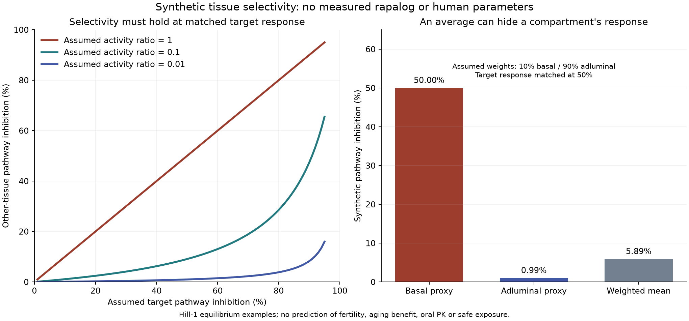

# Rapamycin selectivity and reproductive endpoints

Prepared 2026-10-09 by an AI coding assistant for this personal hobby and
learning project. This focused primary-source review follows the user's
question about retaining a rapamycin-related benefit while reducing testicular
effects. It adds a synthetic selectivity model, not a new rapalog, treatment
regimen or demonstrated fertility-protection strategy. Source review and
calculations are agent-run work; none is attributed to the owner.

## The main design conclusion

The most defensible research objective is **retained target-organ function
with reduced pathway inhibition in relevant testicular cell types**.
mTORC1-versus-mTORC2 selectivity, oral availability, tissue partitioning and
reproductive protection are separate properties. Improving one cannot establish
the others. The existing atlas mTOR classifier cannot measure these properties.

For systemic aging research, first define the benefits that must be retained
in each tissue. For a narrower brain, skin or immune indication, a restricted
distribution strategy can have an interpretable goal. The same restricted
strategy cannot simultaneously be assumed to preserve every systemic effect.
This is a design inference, not a clinical outcome established by the review.

## What the primary sources establish

**Human reproductive signal:** a renal-transplant cohort associated sirolimus
with poorer sperm measures and fewer fathered pregnancies. Only three of six
patients who interrupted treatment showed significant sperm-parameter
improvement. These observational data do not establish a risk frequency,
testicular-volume effect or recovery guarantee in healthy users.
[Human cohort](https://pubmed.ncbi.nlm.nih.gov/18510638/).

**Adult animal evidence:** an everolimus/sirolimus study found testis and sperm
effects in juvenile and adult mice, with recovery varying by endpoint and
exposure. A separate adult-mouse study found disrupted testicular mTORC1 and
mTORC2 signaling and meiotic processes, with recovery of several outcomes
after cessation. Neither establishes recovery for every human outcome.
[Everolimus study](https://pubmed.ncbi.nlm.nih.gov/32716476/),
[adult meiotic study](https://pubmed.ncbi.nlm.nih.gov/30636722/).

**Complex selectivity:** DL001 improved mTORC1 selectivity and metabolic/immune
outcomes in mice. Its reported tissue panel and outcomes did not establish
testicular or sperm protection. Developmental mouse work independently supports
an mTORC1 requirement in germ-cell differentiation. Thus, sparing mTORC2 alone
does not prove reproductive safety.
[DL001 primary study](https://www.nature.com/articles/s41467-019-11174-0),
[germ-cell differentiation study](https://pmc.ncbi.nlm.nih.gov/articles/PMC4641790/).

**Cell type matters:** a Sertoli-cell genetic study altered barrier integrity
and sperm methylation through Rptor/Rictor deletion. Rptor deletion reduced
testis weight without significantly changing the reported sperm parameters;
Rictor deletion affected both. Sperm motility was not assessed. This is a
cell-specific genetic model, not a drug trial or proof of rejuvenation.
[Sertoli-cell study](https://elifesciences.org/articles/90992).

That study's barrier diagram also locates spermatogonia in the basal
compartment, outside the protected adluminal compartment. The inference is
that poor barrier crossing alone cannot establish protection of all testicular
cells. It is particularly unsafe as an inference to equate brain exclusion
with whole-testis exclusion: these are different anatomical barriers.
[Primary barrier diagram, Figure 1](https://pmc.ncbi.nlm.nih.gov/articles/PMC11405012/).

## Published approaches and their limits

| Approach | Observed result in the reviewed source | Missing for the user's question |
|---|---|---|
| DL001 | More selective mTORC1 inhibition with improved metabolic/immune outcomes in mice | Reproductive endpoints, relevant cell exposure and retained human aging benefit |
| RapaLink-1 plus RapaBlock | Brain inhibition retained while skeletal-muscle inhibition was blocked; efficacy in mouse glioblastoma models | Testicular protection, systemic geroprotection and an oral human binary regimen |
| Cholesterolated rapamycin liposomes | IV platform with preferential liver accumulation and antigen-specific immune tolerance | Free testicular exposure, reproductive outcomes, oral systemic delivery and aging efficacy |
| Local topical rapamycin | Exploratory human skin-marker results with blood concentrations below the assay's detection limit in sampled participants | Reproductive evaluation and whole-body aging benefit |

The binary strategy uses a brain-permeant inhibitor and a brain-impermeant
FKBP12 ligand. It suppresses inhibitor activity broadly outside the brain,
so it is not a demonstrated way to spare only the testis while retaining
muscle, liver and immune effects. The reviewed study did not establish
reproductive protection. [Binary-pharmacology primary study](https://www.nature.com/articles/s41586-022-05213-y).

The 2026 liver-directed liposomal study used a rapamycin-cholesterol conjugate
and IV delivery for immune tolerance. Targeted carrier accumulation is a useful
precedent, but the retrieved abstract does not supply a testicular free-drug
assessment. A carrier label also need not track released active parent.
[Primary liver-platform study](https://pubmed.ncbi.nlm.nih.gov/41674289/).

The skin trial enrolled 36 people; 17 completed, 13 provided blood samples,
and eight tissue samples supplied reliable material for further analysis.
Blood rapamycin was below 1 ng/mL, the assay detection limit, at the sampled
visit. This is neither zero exposure nor a complete PK profile. Marker changes
and appearance observations are not systemic rejuvenation or fertility safety.
[Primary skin trial](https://pubmed.ncbi.nlm.nih.gov/31761958/).

## Three concrete hypotheses to compare

**A. A target-tissue activation system.** Define a target organ and a trigger
that generates active parent mainly there. Compare parent formation in target
tissue, blood and relevant testicular compartments; establish released-parent
distribution and retained functional benefit. If cleavage occurs in plasma or
active parent redistributes systemically, the proposed selectivity may fail.
No trigger, linker or activation rate is specified as validated here.

**B. A local delivery system for a local benefit.** This has a clearer objective
when the endpoint is confined to an accessible organ. Track systemic parent
exposure and the intended local function independently. Low blood signal does
not prove absent testicular exposure, and local effects cannot be relabeled as
whole-body geroprotection. The skin trial is a precedent for the narrower
question, not a reproductive-protection experiment.

**C. A cell-selective protective component with an FKBP-dependent inhibitor.**
Binary pharmacology supplies a mechanism precedent. A testis-selective
protective component would need measured entry into the relevant cell types,
adequate occupancy while inhibitor is present, and negligible interference in
the desired target tissues. It must also preserve native cell function. A
peripheral blocker that protects every peripheral tissue would defeat a goal
of retaining benefits there. No testis-selective component is designed or
validated in this review.

These hypotheses describe experimentally discriminating requirements. A
chemical drawing without credible activation/distribution data cannot answer
which design is better. Neither a shorter plasma half-life nor a lower total
testis concentration establishes reduced pathway suppression at matched
target-organ benefit.

## Synthetic selectivity model

The [standard-library model](selectivity_model.py) uses linear partitioning
and a Hill-1 pathway-inhibition relation. All inputs are invented examples.
There are no DL001, rapamycin or human PK values, no aging-function prediction
and no fertility-risk model. Each illustrative tissue has a total partition
factor, a free fraction and a pathway IC50 on one arbitrary common scale.

```text
I = C_unbound / (IC50 + C_unbound)
rho = (Kp_other * fu_other / IC50_other)
      / (Kp_target * fu_target / IC50_target)
I_other = rho * odds(I_target) / (1 + rho * odds(I_target))
odds(I) = I / (1 - I)
```

A common plasma binding factor cancels from the relative partition ratio.
This is an algebraic simplification under the assumptions, not a measurement
of intracellular drug at the relevant mTOR complexes. Target pathway matching
also does not establish matched functional benefit.

| Synthetic change | Other-tissue inhibition when target inhibition is matched at 50% |
|---|---:|
| Reference with equal normalized sensitivity | 50% |
| Tenfold less exposure everywhere | 50% |
| Tenfold greater potency everywhere | 50% |
| Tenfold lower other-tissue unbound partition | 9.09% |
| Tenfold lower other-tissue pathway sensitivity | 9.09% |
| Tenfold lower total other-tissue partition, offset by tenfold higher free fraction | 50% |

The last example directly demonstrates why total-tissue measurements alone
can mislead. Reducing exposure or changing potency globally does not create
tissue selectivity after the target response is matched.

For arbitrary target inhibition `a` and other-tissue bound `b`, the model gives
`rho <= odds(b) / odds(a)`. Choosing 50% target and 10% other inhibition requires
`rho <= 1/9`; choosing 80% target with the same 10% other bound requires
`rho <= 1/36`. **These illustrative bounds have no established biological
meaning and are not acceptable fertility-risk or human-exposure thresholds.**

A second counterexample assigns hypothetical weights of 10% to a basal proxy
and 90% to an adluminal proxy. At matched 50% target inhibition, the proxies
have 50% and 0.99% inhibition respectively. Their weighted average is only
5.89%, hiding the high response in the smaller compartment. The weights are
not measured anatomical fractions. This does not predict germ-cell injury;
it demonstrates an aggregation problem.

Exact inputs and outputs are in [synthetic_selectivity.json](synthetic_selectivity.json).
No mTORC2 coupling, feedback, FKBP12 occupancy, prodrug release, clearance,
time dependence or cell population dynamics is included.



## Required evidence before selecting a candidate

Keep these as independent endpoints: target-organ function; free active-parent
exposure; testicular cell-type pathway responses; sperm quantity, motility and
morphology; endocrine measures; structure/volume; and recovery. Measurements
need relevant comparison groups and exposure matching. Direct reproductive
outcomes are necessary even if a pathway or distribution result looks favorable.
Record anatomical and temporal context rather than rely on a single whole-testis
average or the word selective.

The reviewed sources do not establish an oral rapalog that preserves systemic
aging benefits while reducing testicular shrinkage or fertility risk in humans.
They do supply mechanisms and comparisons that can make that research question
more precise.

## Access and validation

[Source receipts](source_receipts.json) record access modes and hashes for
five downloaded primary full texts: DL001, adult meiosis, binary pharmacology,
Sertoli genetics and local skin delivery. Everolimus and the liver platform
were assessed using official primary abstracts; the human transplant cohort
used its primary abstract. A separate barrier-study XML request returned
HTTP 500; the anatomical conclusion above instead uses the successfully read
Sertoli-study diagram. No inaccessible full-text claim is invented. Copyrighted
full texts remain in ignored local storage.

Reproduce in Docker `dev`:

```bash
cd geroscience-compound-atlas/studies/rapamycin-selectivity-2026-10-09
python3 selectivity_model.py
python3 -m unittest test_selectivity_model -v
../../.venv/atlas-review-runtime/bin/python plot_selectivity.py
```

All **8 mathematical checks** passed, covering independent response identities,
matching, global-change invariance, free-versus-total exposure, analytic bounds,
aggregation, impossible targets and invalid inputs. The prescribed atlas
hypothesis-filter/split checks passed **9 tests**. The scientific figure was
visually inspected. New-code Ruff passed with `EXE002` excluded for Windows
bind-mount executable flags. These checks validate calculations, not biology.
Curated evidence grades/tables and frozen benchmark/split/generator settings
were retained.
