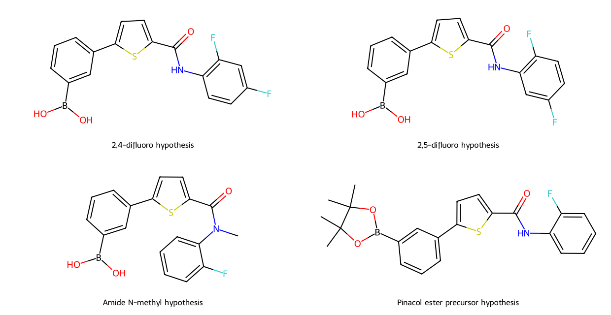
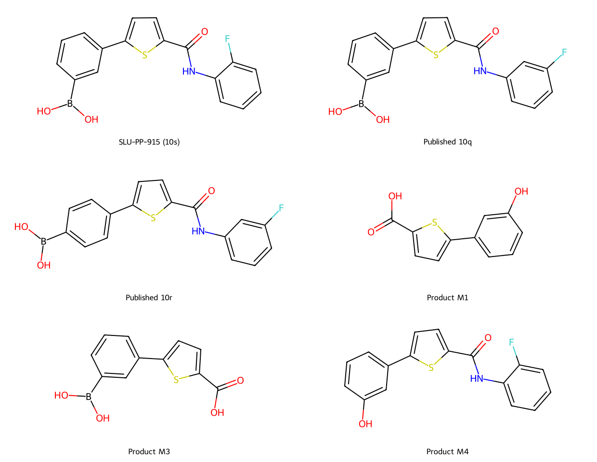

# SLU-PP-915: oral-development comparisons and exact structures

Prepared 2026-10-09 by an AI coding assistant for this personal hobby and
learning project. This is a continuation of the
[initial feasibility analysis](../oral-targeting-feasibility-2026-10-09/README.md).
It defines ten exact graphs: parent, two published ERR comparators, three
confirmed transformation products, and four unvalidated comparison hypotheses.
No synthesis or biological testing was performed. No owner laboratory work or
source review is claimed. The hypotheses have no novelty or improved-drug claim.

## What changes the design decision

**915 already has oral activity in mice.** A 2026 study reports oral
exercise-capacity effects, with efficacy compared after accounting for
systemic exposure. This review accessed the official abstract and does not
extract a quantitative absolute oral bioavailability. Mouse oral activity
does not establish human exposure, tolerability or biological-age reversal.
[Primary oral study](https://pubmed.ncbi.nlm.nih.gov/41421047/).

**The boronic acid was part of a measured medicinal-chemistry improvement.**
The 2023 discovery study found retained ERR agonism and microsomal stability
reported as >60 minutes for 10s and 10q in both mouse and human microsomes.
The experiment ran up to 60 minutes: those values are lower bounds, not
measured systemic half-lives. Related positional isomers had different
maximal responses. Proposed docking poses implicate boronic-OH and amide-NH
interactions, but do not resolve a unique bound pose or prove donor necessity.
[Primary discovery study, docking and Tables 4–5](https://pubmed.ncbi.nlm.nih.gov/37421886/).

| Published compound | ERRα EC50, µM / efficacy % | ERRβ EC50, µM / efficacy % | ERRγ EC50, µM / efficacy % |
|---|---:|---:|---:|
| 10s, SLU-PP-915 | 0.414 / 90 | 0.435 / 95 | 0.378 / 167 |
| 10q, aniline fluorine moved to meta | 0.108 / 59 | 0.117 / 107 | 0.238 / 214 |
| 10r, also moving boronic acid to para | 0.030 / 30 | 0.089 / 120 | 0.182 / 53 |

Efficacy percentages use the publication's compound-6 reference within each
assay. A lower EC50 with lower maximal response is not an interchangeable
improvement. These data cannot rank oral efficacy or human benefit.
[Machine-readable observations](published_assay_observations.json) retain
censoring and mark 10r stability absent from Table 5.

**Breakdown products are analytically defined, but their activities are not.**
The 2026 analytical study confirmed M1, M3 and M4 against synthesized
reference compounds. M1 combines amide hydrolysis and boronic-acid-to-phenol
conversion; M3 reflects hydrolysis; M4 reflects phenol formation. All three
also appeared in an enzyme blank. M6 was assigned to aniline-ring
hydroxylation; an exact carbon is not established here. Product detection
does not supply pathway rates, human abundance or ERR activity. It therefore
cannot show which route dominates human clearance.
[Primary metabolism study, Table 2 and transformation section](https://pubmed.ncbi.nlm.nih.gov/41588687/).

The design inference is to distinguish chemical loss, enzyme-dependent loss,
poor dissolution and poor transport before selecting a molecular change.
Changing a group that already improved microsomal stability could undo that
gain. Testing activity of intact parent and products separately also prevents
an active product from being mistaken for sustained parent exposure.

## Four specific comparison hypotheses

The names below identify covalent structures, not available medicines.
All four retain the central 2,5-disubstituted thiophene connectivity. Their
activity, oral exposure, chemical stability and toxicity are unestablished.

| Exact comparator | Question it isolates | Main tradeoff / reason it could fail |
|---|---|---|
| 2,4-difluoro aniline variant | Does adding para fluorine change aniline-ring turnover while retaining the parent response? | The observed hydroxylation carbon is not mapped; loss may shift elsewhere or response may fall |
| 2,5-difluoro aniline variant | Does an alternative fluorine position behave differently from 2,4 substitution? | Same formula and coarse descriptors can hide different binding, electronics and turnover |
| Amide N-methyl variant | Do changed amide sterics and donor loss alter hydrolysis while retaining ERR function? | Hydrolysis resistance is not assumed; removal of the NH could damage binding or change conformation |
| Boronic pinacol ester precursor | Can a masked structure deliver and release intact 915 rather than merely producing persistent ester signal? | Two boronic-OH donors disappear; activation, dissolution, oxidative conversion and parent access are unknown |

The fluorine variants test two sites without declaring either the M6 hotspot.
The N-methyl variant is a mechanistic comparator, not a recommendation to
remove an amide donor. The ester is a **precursor hypothesis**, not a direct
substitute with assumed ERR activity. Retaining an aryl–boron bond does not
by itself establish protection from oxidative conversion.



### What the calculations establish

[JSON definitions](structural_comparators.json) and
[SDF molecular graphs](structural_comparators.sdf) provide canonical SMILES,
InChIKeys, formulas, charge and descriptor conventions. The parent matches
an independently retrieved official PubChem formula, exact mass and InChIKey:
[CID 142532359](https://pubchem.ncbi.nlm.nih.gov/compound/142532359).
Neutral graphs exclude salts and pH-dependent speciation; a neutral drawn
structure does not imply zero charge in every biological compartment.

| Defined structure | Formula | Average mass, Da | RDKit HBD | Sulfur-inclusive TPSA, Ų | Crippen logP |
|---|---|---:|---:|---:|---:|
| Parent | C17H13BFNO3S | 341.172 | 3 | 97.80 | 2.486 |
| Either difluoro variant | C17H12BF2NO3S | 359.162 | 3 | 97.80 | 2.625 |
| Amide N-methyl | C18H15BFNO3S | 355.199 | 2 | 89.01 | 2.511 |
| Pinacol ester | C23H23BFNO3S | 423.318 | 1 | 75.80 | 5.106 |

These are calculated descriptors, not permeability, solubility, logD,
hydrolysis or PK measurements. A lower polar surface area or higher logP
does not establish better oral exposure. The ester increases mass and
calculated lipophilicity substantially; a release/dissolution tradeoff remains.

Both RDKit default TPSA and sulfur-inclusive TPSA are recorded. For parent
they are 69.56 and 97.80 Ų, respectively. Descriptor convention alone
therefore changes the number; silently merging them would introduce an
artifact. RDKit acceptor counts are also algorithm-specific. No oral rank,
QED score, ERR model probability or aging score is assigned.

## Why the reference panel matters

Published 10q/10r are positional-isomer controls with measured ERR responses;
M1/M3/M4 are analytically confirmed product controls whose responses are
unknown in this review. The analytical study's 915-Cl internal standard is
not promoted to a functional analog. M2/M5/M6 are omitted from the exact
graph panel because their positional assignments are not resolved sufficiently
here to give one exact identity without an added assumption.



The original discovery manuscript contains apparent transcription/typographic
inconsistencies, including a 10q/10r analytical mass entry inconsistent with
the stated formula. This panel uses their explicit systematic names and
does not reproduce that mass as an identity reference. BioC can omit table
substitution diagrams; names establish connectivity here. Parent identity
has the separate PubChem check. These limitations are not corrected into
unreported primary measurements.

## A decision sequence for making oral performance better

1. **Resolve parent loss and recovery first.** Compare intact-parent recovery
   across the relevant formulation/physiological matrices and enzyme-free
   versus active systems. Separate degradation, precipitation, adsorption
   and analytical conversion. Product detection alone cannot apportion rates.
2. **Keep unchanged-parent delivery as a comparator.** If dissolution or
   formulation loss dominates, compare parent delivery approaches before
   declaring a new covalent structure necessary. No excipient recipe or
   human formulation is established in this study.
3. **Require retained function for every analog.** Keep ERRα/β/γ EC50 and
   maximal response separate; pair reporter results with an orthogonal
   engagement/function readout and cytotoxicity assessment. An apparent
   signal change can reflect assay interference or altered active species.
4. **Measure relevant exposure.** Distinguish intact parent, precursor and
   products; total signal, unbound signal and target-tissue exposure are
   separate. Increasing total blood residence is insufficient if usable
   intracellular exposure or function declines.
5. **Compare routes and outcomes independently.** Absolute oral availability
   requires a suitable route reference and interpretable PK. Exercise-related
   gene expression, organ function, adverse effects and aging-clock measures
   remain separate endpoints. None alone shows systemic rejuvenation.

This sequence and its priorities are research judgments, not completed
experiments or instructions for administration. Neither the parent nor any
defined comparator is presented as safe for personal use.

## Provenance and reproduction

[Source receipts](source_receipts.json) archive three primary papers and an
official property retrieval. The discovery full text was read through the
official NCBI BioC API after Europe PMC fullTextXML failed; the metabolism
full text was read through Europe PMC. The oral-study assessment is abstract
only. Download hashes are retained; copyrighted full text stays in ignored
local storage. [Parent reference](parent_identity_reference.json) archives the
official identity properties used by the structural checks.

Run inside the workspace Docker `dev` service:

```bash
cd geroscience-compound-atlas/studies/slu915-oral-comparators-2026-10-09
../../.venv/atlas-review-runtime/bin/python build_structures.py
../../.venv/atlas-review-runtime/bin/python -m unittest test_structures -v
cd ../..
.venv/atlas-review-runtime/bin/pytest tests/test_hypothesis_filters.py tests/test_splits.py -q
.venv/atlas-review-runtime/bin/ruff check studies/slu915-oral-comparators-2026-10-09 --ignore EXE002
```

RDKit 2026.03.6 produced the outputs. Eight checks cover independent parent
identity, source-product formula accounting, substitution positions, exact
amide methylation, boronic ester connectivity and representation round trips.
Both depictions were visually inspected. These checks validate graph
definitions, not drug performance. Curated evidence grades, frozen inputs,
splits and model/generator configurations are unchanged.
