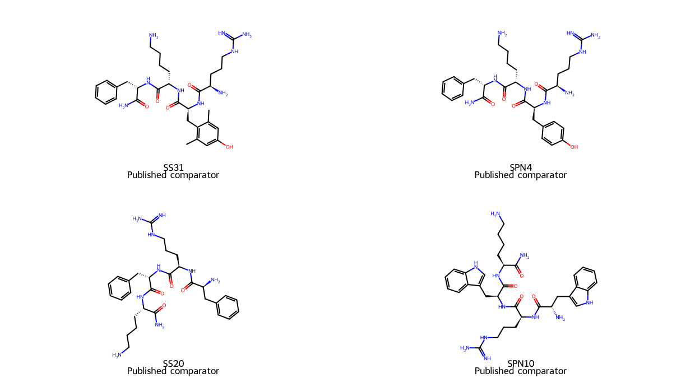
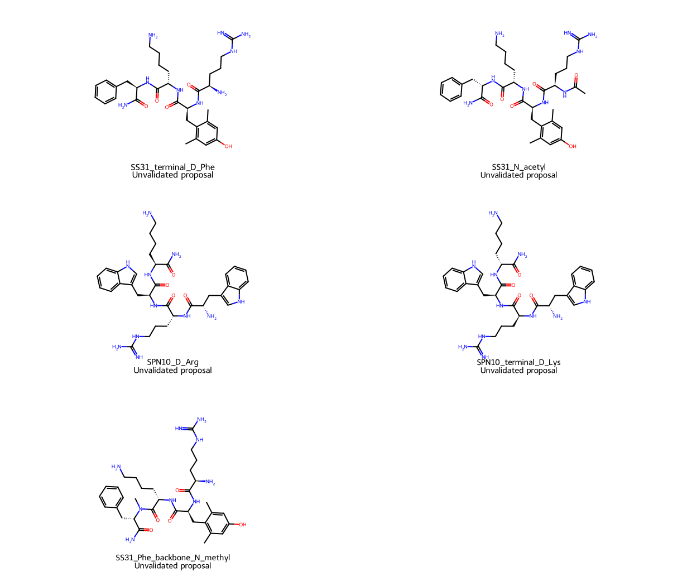

# SS-31 analog audit and explicit structural comparators

Prepared 2026-10-09 by an AI coding assistant for this personal hobby and
learning project. This focused source audit corrects one earlier evidence
classification and creates exact molecular graphs for research comparisons.
No hypothesis was synthesized, tested or shown to improve human oral exposure,
duration, manufacturing cost or aging outcomes. No novelty claim is made.

## Published evidence changes the starting set

The Tyr comparator previously labeled an unvalidated hypothesis is **SPN4**,
a published comparator. In the 2022 study it had weaker membrane-potential
restoration but stronger viability effects than SS-31 under the tested cell
stress conditions. **SPN10**, Trp-Arg-Trp-Lys-NH2 with all L residues, performed
better in several cell endpoints despite similar membrane-binding affinities
across the four peptides. Localization experiments used biotinylated variants.
These are membrane/cell results, not administered-human or oral-PK evidence.
[Primary structure-activity paper, Figures 1, 2 and 6](https://elifesciences.org/articles/75531).

The inference is that function cannot be ranked by binding affinity alone.
SPN4 is a real comparator for the specialty-residue question, and SPN10 is a
useful functional benchmark for new modifications. Neither is established as
a cheaper interchangeable SS-31 product or an orally useful human drug here.
The original eight-record file retains its old `SS_Tyr_hypothesis` identifier
for compatibility while correcting its status, adding the SPN4 alias and source.

## One precise oral-delivery proposal from a patent

US20240108740A1 describes backbone N-methylation, including at the Phe residue,
and explicitly predicts oral improvements through stability and permeability.
It also describes reduced-amide and D-residue strategies. These statements
are proposed development approaches, not a measured oral-PK demonstration.
[Primary patent, Therapeutic Peptide Analogues](https://patents.google.com/patent/US20240108740A1/en).

The present graph set includes **H-D-Arg-L-Dmt-L-Lys-NalphaMe-L-Phe-NH2**.
`NalphaMe` means methylation of Phe's backbone nitrogen at the Lys-Phe amide.
It does not methylate the Lys side-chain amine, the N-terminal amine or the
terminal carboxamide nitrogen. This positional distinction matters for both
identity and the nominal charge.

Our graph calculations give C33H51N9O5 and preserve the nominal physiological
charge of +3. The neutral graph loses one hydrogen-bond donor. By comparison,
N-terminal acetylation gives C34H51N9O6 and nominal +2. These are chemistry
facts for the specified structures, not a predicted permeability gain. The
N-methyl proposal is a cleaner comparison of a backbone donor change against
the original cationic pattern; it still changes conformation and recognition.

## Nine graphs with different evidence states

| Graph | Intended role | Main unresolved comparison |
|---|---|---|
| SS31 | Published parent reference | Benchmark for every other structure |
| SPN4 | Published Tyr comparator | Functional equivalence for the chosen endpoint and actual process cost |
| SS20 | Published related scaffold | Different aromatic chemistry/register; cannot substitute by name alone |
| SPN10 | Published all-L Trp comparator | Intact exposure, degradation and activity in the chosen target tissue |
| SS31_terminal_D_Phe | Stereochemistry hypothesis | Does a terminal inversion reduce parent loss while preserving function? |
| SS31_N_acetyl | Terminal-cap hypothesis | Charge change, cellular access and retained activity |
| SPN10_D_Arg | Single internal inversion hypothesis | Cleavage-site relevance and retained function; both unknown |
| SPN10_terminal_D_Lys | Single terminal inversion hypothesis | Cleavage-site relevance and retained function; both unknown |
| SS31_Phe_backbone_N_methyl | Patent-described hypothesis | Backbone stability/permeability versus activity and parent elimination |

The stereochemistry hypotheses do not assume that a D residue automatically
extends human half-life. The parent-clearance and tissue-access questions from
[the previous research decisions](../oral-targeting-feasibility-2026-10-09/RESEARCH_DECISIONS.md)
still apply. Parent renal elimination can remain limiting even when a particular
cleavage is reduced. An oral carrier or depot formulation is a separate
comparison from changing covalent structure.

## Exact identity and representation limits

[The JSON specification](structural_comparators.json) records isomeric SMILES,
standard InChIKeys, neutral formulae/masses, alpha-carbon configurations,
nominal charges and explicitly labeled neutral-graph descriptors.
[The SDF](structural_comparators.sdf) contains the same nine graphs with 2D
coordinates and evidence-state labels. It is not a predicted binding pose
or bioactive conformation. These files are molecular definitions, not physical
sample certificates, synthesis recipes or selected human-use candidates.

SS31's computed formula, mass and stereochemical InChIKey match the independent
[PubChem CID 11764719 record](https://pubchem.ncbi.nlm.nih.gov/compound/11764719).
The downloaded official REST response and source hashes are documented in
[source receipts](source_receipts.json). Matching a graph to a registry record
does not establish the identity or purity of any material someone possesses.

Stereochemical inversions preserve mass and the reported 2D descriptors while
changing stereochemical identity. That is a useful illustration of why these
descriptors cannot rank stability or biological activity. The neutral structures
have formal charge zero because salts and explicit physiological protonation
are excluded. Their nominal +3 or +2 charges are separate residue-state
estimates; they are not measured pKa distributions.

Neutral Crippen logP is not pH-dependent logD. TPSA, donor counts and rotatable
bonds are screening descriptors, not intestinal transport, mitochondrial access
or human PK. We deliberately do not calculate a weighted oral score or feed
these graphs into the atlas's mTOR surrogate: a score trained for another
target would not answer this question.





## Decision sequence

1. Use SS31, SPN4 and SPN10 as separate controls for the selected functional
   endpoint. Define parent and relevant products independently.
2. Compare one covalent modification at a time at matched free exposure.
   Structural validity, retained function and intact-parent recovery precede
   any claim of better delivery.
3. Distinguish gastric/intestinal stability, epithelial transport, systemic
   intact-parent exposure and useful target-tissue activity. An in vitro
   transport result alone cannot establish absolute oral bioavailability.
4. For duration, distinguish chemical degradation from renal parent clearance
   and persistence of function after exposure falls.
5. Evaluate manufacturing economy independently using actual material,
   purification, yield, impurity and stability measurements. Proteinogenic
   ingredients do not by themselves establish lower final cost.

These comparisons are proposed research decisions, not instructions for
self-experimentation or biological results obtained in this project.

## Reproduction and validation

Use the existing Docker `dev` environment and its installed RDKit runtime:

```bash
cd geroscience-compound-atlas/studies/ss31-analog-audit-2026-10-09
../../.venv/atlas-review-runtime/bin/python build_structures.py
../../.venv/atlas-review-runtime/bin/python -m unittest test_structures -v
../../.venv/atlas-review-runtime/bin/python draw_structures.py
```

The run used RDKit 2026.03.6. Both depictions were visually inspected.
All **9 structural checks** passed: independent parent identity, intended
alpha stereochemistry, isomer versus formula distinction, acetyl composition,
Trp-reference residue balance, backbone-methyl position/donor accounting,
SMILES and SDF identity round trips, and invalid-specification handling.
The corrected earlier generator was rerun; its **15 study checks** also passed.
The prescribed atlas hypothesis-filter/split checks passed **9 tests**.
New/changed Python Ruff checks passed with the Windows-mount `EXE002` excluded.

These checks validate identity bookkeeping and calculations, not biological
activity. Curated grades, target tables, frozen datasets/splits, benchmark
thresholds and generator settings are unchanged. Source review and graph
construction are agent-run work, not attributed to the owner.
